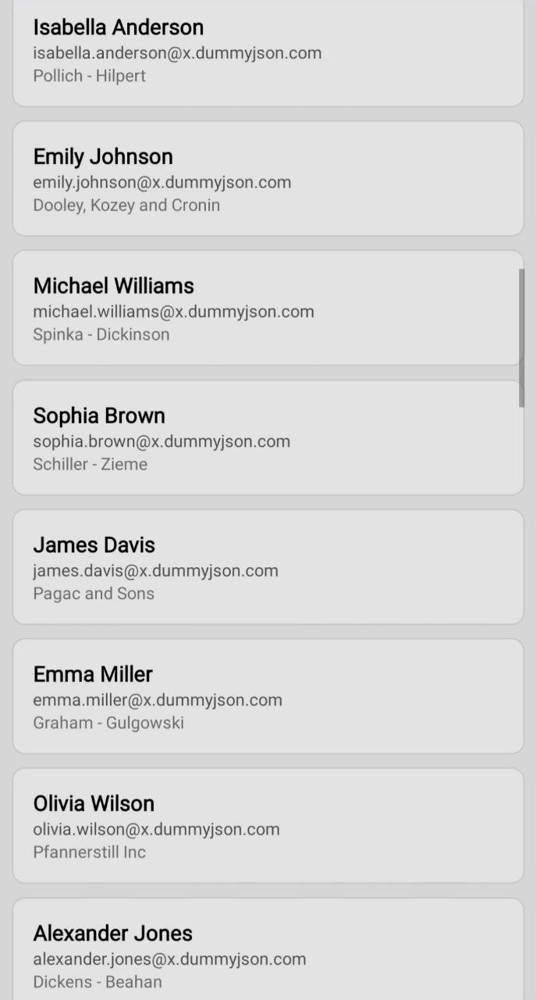

# User Explorer


## Project Description

User Explorer is a mobile application built with React Native and Expo. It fetches and displays a list of users from the DummyJSON API, allowing users to view a list of posts by each user. The app features infinite scrolling, optimized performance, and a user-friendly interface.

## Features

- Fetches and displays a list of users from the DummyJSON API.
- Allows users to view posts by each user.
- Infinite scrolling to load more users and posts.
- Optimized rendering for smooth performance.
- Built with Expo and React Native for cross-platform compatibility.

## Screenshots

| User List Screen                         | User Posts Screen                         |
| ---------------------------------------- | ----------------------------------------- |
|  |  |

## Technology Stack

- **Frontend:** React Native, Expo
- **State Management:** MobX-State-Tree
- **Networking:** Axios
- **Navigation:** React Navigation
- **UI Components:** React Native Gesture Handler, React Native Reanimated

## Installation Instructions

### A. Setting Up the Project Locally

Follow these steps to set up the User Explorer project on your local machine:

1. **Clone the Repository**
   
   ```bash
   git clone https://github.com/abelkraju/User_Explorer.git
   
2. ### Navigate to the Project Directory

   ```bash
     cd User_Explorer

3. ### Install Dependencies

   Make sure you have [Node.js](https://nodejs.org/) installed on your machine. Then, install the project dependencies using npm:

    ```bash
      npm install
4. ### Set Up Expo CLI

   If you don't have Expo CLI installed globally, install it using npm:

    ```bash
      npm install -g expo-cli
5. ### Run the Project

   Start the development server using Expo:

    ```bash
      npm start
6. ### Use the Expo Go App

   Use the Expo Go app on your mobile device to scan the QR code and run the app.

   You can also run the app on an Android emulator or iOS simulator using the respective commands:

    ```bash
      npm run android
      npm run ios
B. **Downloading the App from GitHub Release**

To download and install the User Explorer app on your Android device:

**Go to the Releases Page**

- Visit the [Releases](https://github.com/abelkraju/User_Explorer/releases) page of the repository.

**Download the App Bundle**

- Find the latest release (v1.0.0) and download the AAB file named `UserExplorer-v1.0.0`.


    
    
